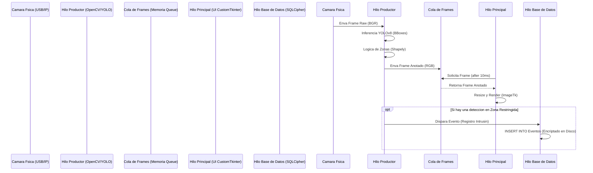

# 2. PLANNING: Ruta Crítica hacia la Versión B2B Multi-Tenant 1.0 (Oficina Eficiencia)

Este documento detalla la metodología ágil, el desglose de Fases (Sprints) y el plan de mitigación de riesgos para transformar un prototipo funcional en un producto de Grado Militar Enterprise con licencia DRM (Offline).

**🚨 DIRECTIVA DE PLANEACIÓN PARA IAs (ANTI-VIBE HACKING PROTOCOL) 🚨**
> *La secuencia descrita a continuación es ley (The sequence below is law).* **No puedes alterar el orden de estos pasos bajo ninguna circunstancia, ya que cada fase construye la base para la siguiente.** Intentar empaquetar con PyArmor (Fase 4) antes de estabilizar el Threading de UI (Fase 1 y 2) imposibilitará la depuración de errores y violará este protocolo. Cualquier IA de compilación que intente "optimizar" o consolidar fases será detenida automáticamente. Toda refactorización debe estar versionada.

---

## 2.1 Visión General de las Fases de Escalamiento

El proyecto tomará el código base actual (`src/main.py`, `src/gui_app.py`, `config/config.py`) y atravesará una refactorización de 4 "Sprints".

### 2.1.1 Sprint 1: Concurrencia (Zero Blocking Core)
**Duración Estimada (Referencia Humana): 1 a 2 semanas.**
**Objetivo:** Transformar el bucle infinito monolítico de `cv2.VideoCapture()` en un ecosistema de hilos (Threadings) asíncronos basado en el patrón Productor-Consumidor.
*   **Hito 1.1:** Separación del motor YOLOv8/Reconocimiento Facial (Productor) del renderizado de imágenes (Consumidor).
*   **Hito 1.2:** Creación de `CameraManager`, un despachador central que pueda instanciar y destruir hilos de cámaras (USB o RTSP) bajo demanda.
*   **Hito 1.3:** Implementación de `queue.Queue()` para el intercambio seguro (Thread-Safe) de `numpy arrays` anotados entre OpenCV y Tkinter (antes de la migración a CustomTkinter).
*   **Hito 1.4:** Extracción de la generación de Excel (`pandas`) a un `ThreadPoolExecutor` para permitir reportes en caliente sin pausar el hilo principal.

### 2.1.2 Sprint 2: Modernización "Fluid UI" (El VMS B2B)
**Duración Estimada (Referencia Humana): 1 a 2 semanas.**
**Objetivo:** Reemplazar el "Tkinter Rústico" con una experiencia de usuario interactiva y profesional (Dark Mode, Grid View, Single Window) usando `CustomTkinter`.
*   **Hito 2.1:** Diseñar la Ventana Raíz (AppMain) con un Sidebar izquierdo persistente para la navegación sin cierres ni transiciones bruscas.
*   **Hito 2.2:** Programar el "Dashboard Multiplexor" (Grid View) capaz de adaptar la cuadrícula dinámicamente según el número de streams de video entrantes desde `CameraManager` (1x1, 2x2, 3x3).
*   **Hito 2.3:** Integrar el manejo de eventos de doble clic (`<Double-1>`) para expandir un feed de cámara al 100% de la pantalla (Single View) ocultando el Grid temporalmente, sin detener los hilos productores de fondo.
*   **Hito 2.4:** Migrar los formularios de "Añadir Empleado" y "Configurar Zonas" a pestañas o modales limpios dentro del área central, validando inputs y mostrando notificaciones de éxito (Toasts).

### 2.1.3 Sprint 3: Aislamiento Multi-Tenant (B2B Corporativo)
**Duración Estimada (Referencia Humana): 1 semana.**
**Objetivo:** Permitir la gestión concurrente de múltiples sucursales (ej. franquicias) en la misma instalación física del software.
*   **Hito 3.1:** Crear la UI inicial de "Login / Selector de Sucursal" que aparece antes de cargar el Dashboard.
*   **Hito 3.2:** Refactorizar `config/path_utils.py` y `config/config.py`. En lugar de apuntar estáticamente a `%APPDATA%/OficinaEficiencia/data`, las rutas deben depender de una variable global (ej. `Session.active_tenant_id`) resolviendo a `%APPDATA%/OficinaEficiencia/Tenants/[ID]/data`.
*   **Hito 3.3:** Asegurar que el `DatabaseManager` inicie conexiones SQLite usando exclusivametne la ruta dinámica del Tenant activo. Probar aislando vectores faciales (Faces) entre Tenants.
*   **Hito 3.4:** Crear un formulario para Administradores que permita añadir o eliminar Tenants (operaciones de CRUD de directorios en el sistema de archivos de Windows).

### 2.1.4 Sprint 4: Blindaje DRM, Cifrado y Ofuscación (SecOps)
**Duración Estimada (Referencia Humana): 2 semanas.**
**Objetivo:** Proteger el código fuente, los algoritmos de IA y la rentabilidad del producto limitando la ejecución a hardware autorizado (Offline) y encriptando los datos críticos en disco.
*   **Hito 4.1:** Desarrollar `DRMValidator` en `src/security/`. Debe consultar mediante WMI (`Win32_BaseBoard`, `Win32_Processor`, `Win32_DiskDrive`) para forjar el Hash de Máquina Inmutable.
*   **Hito 4.2:** Desarrollar el sistema asimétrico (RSA/AES) de validación Offline. El software debe descifrar un string ingresado por el usuario y compararlo con el Hash de Máquina.
*   **Hito 4.3:** Reemplazar `sqlite3` por `pysqlcipher3`. Todas las bases de datos deben estar cifradas en disco usando una llave derivada del Hash de Máquina (para que sea indescifrable si se copia a otra PC).
*   **Hito 4.4:** Modificar el script `compilar_exe.bat`. Introducir `pyarmor` en el pipeline ANTES de `pyinstaller`. Asegurar que el bytecode cifrado interactúe correctamente con las librerías dinámicas (`torch`, `cv2`, `face_recognition_models`).

---

## 2.2 Diagrama de Secuencia de Flujo de Datos B2B (Texto)

**Flujo en Tiempo Real (Camera -> UI -> Database):**

---

## 2.3 Matriz de Riesgos y Mitigación (Risk Management)

Un proyecto de esta envergadura, especialmente al introducir Ofuscación y Threading concurrente con librerías nativas en C (OpenCV/Torch), presenta riesgos técnicos críticos.

### Riesgo 1: Crash por Múltiples Librerías OpenMP (KMP_DUPLICATE_LIB_OK)
*   **Probabilidad:** Muy Alta.
*   **Impacto:** Crítico (El software cierra sin advertencia en Windows).
*   **Causa:** Conflicto entre los binarios pre-compilados de Intel MKL (Numpy), PyTorch y OpenCV al cargar simultáneamente múltiples hilos de inferencia.
*   **Mitigación:** En el archivo de entrada principal (`src/main_ui.py`), se DEBE ejecutar `import os`, luego `os.environ["KMP_DUPLICATE_LIB_OK"] = "TRUE"`, y *antes de cualquier otra cosa* hacer `import torch` (no diferirlo).

### Riesgo 2: Fugas de Memoria (Memory Leaks) en la Cola de Frames
*   **Probabilidad:** Media.
*   **Impacto:** Crítico (La aplicación consume toda la RAM tras 4 horas de uso, provocando un OOM Kill del sistema operativo).
*   **Causa:** El Productor (OpenCV) genera frames (numpy arrays de 1920x1080) más rápido (30 FPS) de lo que el Consumidor (CustomTkinter UI) los puede renderizar (ej. 15 FPS), llenando la RAM infinítamente.
*   **Mitigación:** Establecer un límite rígido a la cola (`queue.Queue(maxsize=10)`). Si la cola está llena, el productor debe descartar el frame inmediatamente (Drop Frame Protocol) usando un bloque `try-except queue.Full`.

### Riesgo 3: Incompatibilidad entre PyArmor, PyInstaller y Dependencias Binarias Dinámicas
*   **Probabilidad:** Alta.
*   **Impacto:** Crítico (El ejecutable "ofuscado" no arranca, arrojando "ModuleNotFoundError" en `face_recognition` o fallos en librerías `.pyd`).
*   **Causa:** PyArmor oculta el código fuente de las dependencias implícitas; PyInstaller no sabe qué incluir en el `.exe` porque el analizador de imports falla.
*   **Mitigación:** Configurar PyArmor explícitamente solo en el directorio `src/`. En el archivo `gui_app.spec`, listar de manera dura (hardcode) las importaciones ocultas (`hiddenimports=['torch', 'ultralytics', 'scipy', 'sklearn', 'shapely']`) y asegurarse de mapear manualmente los modelos estáticos (`sys._MEIPASS` para `yolov8n.pt` y los modelos `.dat` de face_recognition).

### Riesgo 4: Corrupción de Base de Datos SQLite Concurrente (Database Lock / Corrupt)
*   **Probabilidad:** Media.
*   **Impacto:** Alto (Pérdida de datos de los clientes y registros de empleados).
*   **Causa:** Dos hilos (ej. Hilo Productor insertando un evento y Hilo UI exportando un reporte) intentan escribir o leer de manera intensiva al mismo tiempo en `pysqlcipher3`. SQLite no es un servidor concurrente.
*   **Mitigación:** Serializar todos los accesos a la base de datos a través de una cola de tareas dedicada, o instanciar una sola conexión SQLite con el pragma de base de datos activado (`PRAGMA journal_mode=WAL; PRAGMA synchronous=NORMAL;`) y manejar el error `sqlite3.OperationalError: database is locked` con reintentos controlados y tiempos de espera exponenciales.

---

## 2.4 Plan de Implementación de Modelos Biométricos (Faces)

### 2.4.1 Migración a Hilos para Face Recognition
*   El modelo `face_recognition` (basado en `dlib`) es altamente intensivo en CPU. Correrlo por cada frame bloquearía inmediatamente el `CameraWorker` y retrasaría la cola de video.
*   **Solución B2B (Estrategia "Skip-Frame" Biométrica):** Se implementará un mecanismo donde el modelo YOLO detecta primero si hay una "Persona" (muy rápido, ~10ms). Si detecta una persona, extrae el bounding box (ROI).
*   Solo 1 de cada 10 frames (configurable por el administrador) pasará por el costoso modelo `face_recognition` (que puede tardar ~100ms-200ms en CPU). El resultado (Nombre del Empleado) se cacheará en un diccionario en memoria (`tracker_cache`) usando el ID del Tracker (ByteTrack/SORT) asociado a esa persona durante los siguientes 9 frames.
*   **Resultado:** Reconocimiento facial en tiempo real fluido en computadoras sin tarjetas gráficas empresariales (NVIDIA T4 / RTX).

### 2.4.2 Estructura del Almacén Vectorial B2B (Tenant Isolation)
*   Los vectores biométricos (codificaciones faciales de 128 dimensiones generadas por `dlib`) nunca se guardan en la base de datos SQLite directamente para no saturarla.
*   Se guardan en archivos serializados `.pkl` (Pickle) cifrados o en una estructura `numpy.save` dentro de la carpeta `%APPDATA%/OficinaEficiencia/Tenants/[ID_TENANT]/faces/`.
*   El nombre del archivo corresponde al Hash o ID en la base de datos del empleado.
*   Al iniciar el sistema o cambiar de Tenant, un hilo en background carga estos vectores en la RAM (Diccionario `known_face_encodings` y `known_face_names`) para comparaciones rápidas en memoria durante el monitoreo.

---

## 2.5 Plan de Rollback (Contingencia en Entornos B2B)

Si una versión mayor es desplegada y genera fallos inestables en clientes:
1.  **Backups Automáticos:** En cada inicio del software, antes de modificar esquemas de SQLite (ej. tras una actualización), realizar una copia del archivo `local_tracking.db` a `local_tracking_backup_YYYYMMDD.db`.
2.  **Fallback Executable:** Mantener un instalador `.exe` de la versión monolítica anterior estable; el modelo de Tenant y la base de datos (incluso si se encriptó) mantendrá la estructura heredada compatible o un script de migración en reversa.
3.  **Auditoría de Errores (Error Reporting):** Si la aplicación crashea silenciosamente, el administrador de la empresa B2B puede presionar "Ctrl+Shift+D" en la pantalla de inicio para generar un volcado de memoria encriptado (Dump File) en `.zip` para ser enviado al equipo de soporte, sin revelar las lógicas DRM de `PyArmor`.

## 2.6 Desglose Diario Recomendado (Sprint Schedule B2B)

Para guiar el esfuerzo de desarrollo (o a la IA ejecutora) de forma estructurada, el proyecto debe adherirse a esta planificación basada en Días de Esfuerzo Equivalentes (EED):

### Semana 1: Backend de Concurrencia (Sprint 1)
*   **Día 1:** Estructuración de hilos. Modificación de `main.py` -> `main_ui.py`.
*   **Día 2:** Refactorización de YOLO (Productor) y Colas de Memoria.
*   **Día 3:** Lógica de Drop Frame (prevención OOM) y limitador de FPS (Throttling).
*   **Día 4:** Extracción y encapsulamiento del Hilo Asincrónico de Pandas (`DatabaseWorker`).
*   **Día 5:** Testing Unitario Exhaustivo y refactorización del Skip-Frame Biométrica (Sec 2.4.1).

### Semana 2: Frontend "Single Window" (Sprint 2 & 3)
*   **Día 6:** Layout CustomTkinter (AppMain, Sidebar). Setup de Temas y Colores B2B.
*   **Día 7:** Dashboard Dinámico (Grid Multiplexor). Lógica Matemática del Grid.
*   **Día 8:** Eventos de Usuario (Doble Clic, Hover) e Integración de Hilos en la Interfaz (Consumidor `.after()`).
*   **Día 9:** Refactorización de `path_utils.py` y despliegue del Formulario de "Selección/Registro de Tenant".
*   **Día 10:** Validación cruzada: Verificar que el código asíncrono no congele a los Tenant.

### Semana 3: SecOps B2B (Sprint 4 & Empaquetado)
*   **Día 11:** Desarrollo del módulo `wmi` (Hardware Fingerprint) y Hashing Criptográfico determinista.
*   **Día 12:** Flujo de Activación Offline (Modal de Interfaz, Descifrado RSA público).
*   **Día 13:** Integración de SQLCipher. Refactorización total de las llamadas de SQLite locales.
*   **Día 14:** Adaptación del `compilar_exe.bat` y pruebas de Ofuscación PyArmor en un directorio `src/` limpio.
*   **Día 15:** Pen-Testing Local (Auditoría), Empaquetado en Inno Setup y Firma Final.

## 2.7 Máquina de Estados de la Arquitectura B2B

El sistema central (UI/AppMain) y el Hilo Productor (CameraWorker) operarán bajo el siguiente conjunto de transiciones de estado estricto:

**AppMain (Main Thread):**
*   `INIT_WAIT`: Solicitando Selección de Tenant B2B a través de UI.
*   `TENANT_SELECTED`: Variables de Entorno (`path_utils`) actualizadas localmente.
*   `DASHBOARD_LIVE`: Mostrando cámaras concurrentes en cuadrícula `CustomTkinter`. (Estado Ideal).
*   `SINGLE_EXPANDED`: Cámara seleccionada en modo Pantalla Completa. Las demás continúan en Background silencioso.

**CameraWorker (Background Daemon Thread):**
*   `IDLE`: Hilo en pausa (sin stream de lectura en memoria).
*   `CONNECTING`: Intentando obtener feed de `cv2.VideoCapture()`.
*   `INFERRING_TRACKING`: Frame extraído. YOLO en ejecución. Zonas poligonales comprobadas usando `shapely`.
*   `BIOMETRIC_CHECK` (Estado Periódico): 1 frame cada X es enviado a reconocimiento facial.
*   `QUEUE_FULL_DROP` (Transición Crítica): La UI es demasiado lenta. Frame procesado es desechado. Regresa a `INFERRING_TRACKING`.
